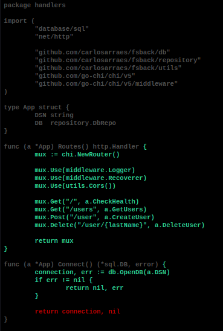
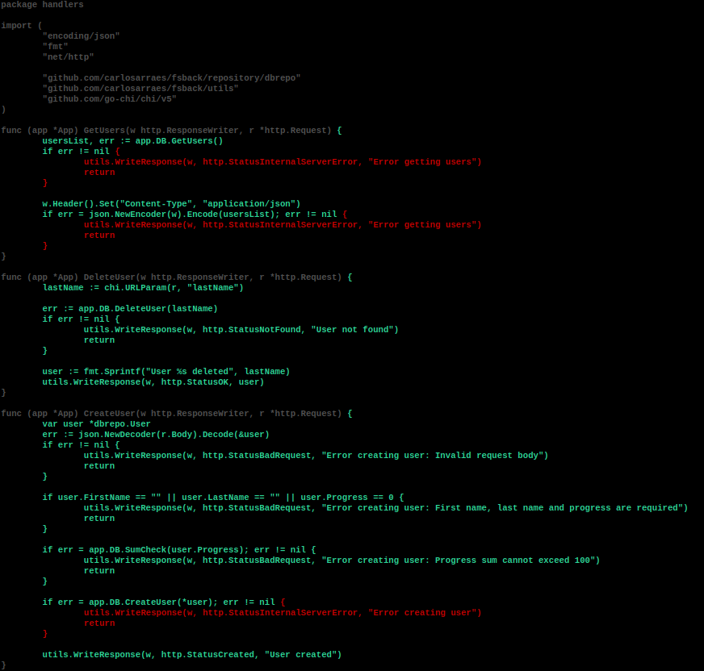

## FS Data Backend

This is a stateless API server written in Golang with go-chi that connects to a containerized PostgreSQL database. It allows for CRUD operations on the database.
You can check the full stack application in this [link](https://fsstack.netlify.app/).

## API and Database

The API is hosted on Google Cloud Run and uses `golang:1.20.1-alpine3.17`. The database uses ElephantSQL server to persist data, with initial data being initialized once the database was created(manually).

<table align="center">
<tr>
<th>Dockerfile</th>
<th>PostgreSQL (Restore)</th>
</tr>
<tr>
<td>

```
FROM golang:1.20.1-alpine3.17

WORKDIR /usr/src/app

COPY go.mod go.sum ./
RUN go mod download && go mod verify

COPY . .
RUN go build -o ./out/dist .

EXPOSE 8080

CMD ./out/dist
```

</td>
<td>

```sql
DROP TABLE IF EXISTS data.user;

CREATE TABLE data.user (
  id SERIAL PRIMARY KEY,
  first_name TEXT NOT NULL,
  last_name TEXT NOT NULL,
  progress NUMERIC NOT NULL
);

INSERT INTO data.user
  (first_name, last_name, progress)
VALUES
  ('Carlos', 'Moura', 0.05),
  ('Fernando', 'Oliveira', 0.15),
  ('Hugo', 'Silva', 0.20),
  ('Eliza', 'Sousa', 0.20),
  ('Anderson', 'Santos', 0.40);
```

</td>
</tr>
</table>

## Endpoints

There are four endpoints available:

Endpoint: `https://gofs-4wgfen3n5q-rj.a.run.app/`

- `GET "/"` Check Health: Returns if the server is running.
- `GET "/users"` Get Users: Returns JSON with all users.
- `POST "user"` Create User: Needs a JSON body to post user.
- `DELETE "/user/:lastName"` Delete User: Deletes user based on last name.

## How to Use Endpoints

You can use your favorite client, such as Insomnia or Postman, or you can use our front-end [link](https://fsstack.netlify.app/).

## Tests

Tests done on routes, connection to db(mock) and tested handlers with a mockedDb. Red lines are uncovered, would need a second mock db that return only errors to test it or a package like [GoMock](https://github.com/golang/mock)

<table>
<tr>
<th>Routes</th>
<th>Handlers</th>
</tr>
<tr>
<th>

  
</th>
<th>


</th>
</tr>
</table>

